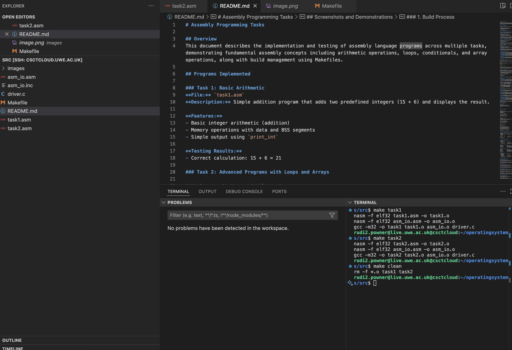
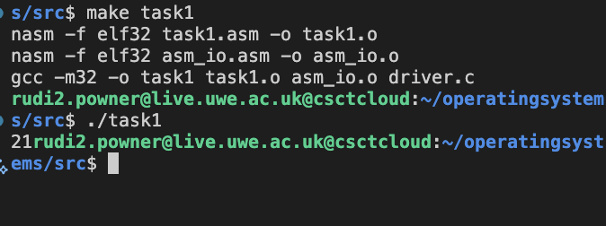
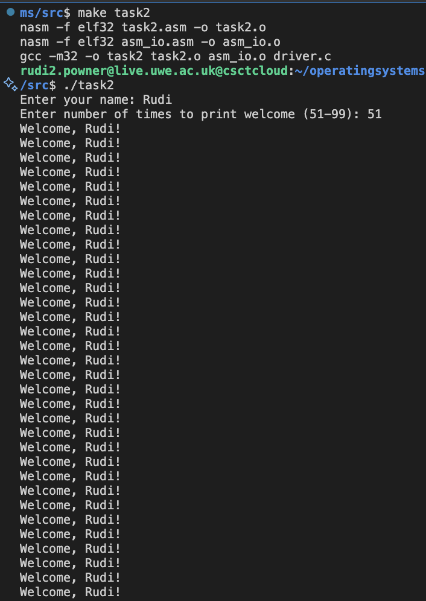
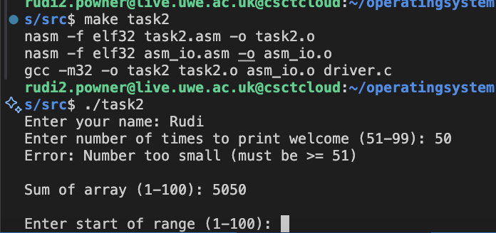
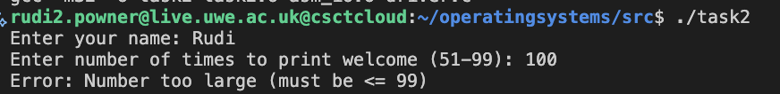
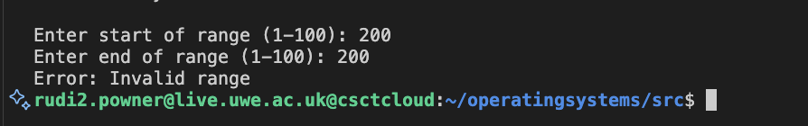

# Assembly Programming Tasks

## Table of Contents
- [Overview](#overview)
- [Programs Implemented](#programs-implemented)
  - [Task 1: Basic Arithmetic](#task-1-basic-arithmetic)
  - [Task 2: Advanced Programs with Loops and Arrays](#task-2-advanced-programs-with-loops-and-arrays)
- [Technical Implementation Details](#technical-implementation-details)
- [Build Process](#build-process)
- [Task 3: Build Management with Makefile](#task-3-build-management-with-makefile)
- [Project Summary](#project-summary)
- [Program Execution Results](#program-execution-results)
- [Key Assembly Programming Concepts](#key-assembly-programming-concepts-demonstrated)
- [Screenshots and Demonstrations](#screenshots-and-demonstrations)

## Overview
This document describes the implementation and testing of assembly language programs across multiple tasks, demonstrating fundamental assembly concepts including arithmetic operations, loops, conditionals, and array operations, along with build management using Makefiles.

## Programs Implemented

### Task 1: Basic Arithmetic
**File:** `task1.asm`  
**Description:** Simple addition program that adds two predefined integers (15 + 6) and displays the result.

**Features:**
- Basic integer arithmetic (addition)
- Memory operations with data and BSS segments
- Simple output using `print_int`

**Testing Results:**
- Correct calculation: 15 + 6 = 21

### Task 2: Advanced Programs with Loops and Arrays

#### Program 1: Name and Welcome Message
**Description:** Asks the user for their name and a number of times to print a welcome message. Validates that the number is between 51 and 99 (inclusive).

**Features:**
- Input validation for range 51-99
- Loop to print welcome message multiple times
- Error handling for values outside valid range

**Testing Results:**
- Valid input (75 times): Successfully printed "Welcome, Rudi!" 75 times
- Too small (25): Displayed error "Error: Number too small (must be >= 51)"
- Too large (150): Displayed error "Error: Number too large (must be <= 99)"

#### Program 2: Array Initialization and Sum
**Description:** Creates an array of 100 elements, initializes it with values 1-100, and calculates the sum.

**Features:**
- Dynamic array initialization using a loop
- Array summation using a loop
- Displays the total sum

**Testing Results:**
- Array sum calculation: Correctly calculated sum as 5050
- Mathematical verification: Sum of 1+2+...+100 = n(n+1)/2 = 100×101/2 = 5050

#### Program 3: Range Sum
**Description:** Extends Program 2 to allow user to specify a range within the array (1-100) and calculates the sum of that range.

**Features:**
- Input validation for range bounds (1-100)
- Range validation (start ≤ end)
- Calculates sum of specified range from the initialized array

**Testing Results:**
- Valid range (10-50): Correctly calculated sum as 1230
- Small range (1-5): Correctly calculated sum as 15 (1+2+3+4+5)
- Invalid range (101-102): Displayed error "Error: Invalid range"

## Technical Implementation Details

### Assembly Techniques Used:
1. **Basic Arithmetic:** Integer addition and memory operations (Task 1)
2. **Loops:** Used `loop` instruction with ECX counter for iteration (Task 2)
3. **Conditionals:** Used `cmp` and conditional jumps (`jl`, `jg`, `jle`) (Task 2)
4. **Array Operations:** Calculated addresses using base + offset arithmetic (Task 2)
5. **String Processing:** Reading and storing complete strings (Task 2)
6. **Input/Output:** Used `asm_io.inc` functions for user interaction
7. **Stack Management:** Used `pusha`/`popa` for register preservation
8. **Build Management:** Makefile for automated compilation (Task 3)

### Memory Layout:
- **Data Segment:** String literals and messages
- **BSS Segment:** Uninitialized arrays and variables
- **Text Segment:** Program code organized into subroutines

## Build Process

### Using Makefile (Recommended)
A simple Makefile has been created following the task requirements. Available targets:

```bash
# Build all programs (default)
make

# Build individual programs
make task1
make task2

# Clean up generated files
make clean
```

### Manual Build Process
For reference, the manual build process involves:

```bash
# Assembly step
nasm -f elf32 filename.asm -o filename.o

# Linking step  
gcc -m32 -o executable object_files driver.c
```

## Task 3: Build Management with Makefile

### Makefile Implementation
Following the task requirements, a simple Makefile has been created with rules to build each executable program from the previous tasks. The Makefile follows the basic format shown in the task examples, with:

- A default `all` target that builds both programs
- Individual targets for `task1` and `task2`
- Complete build commands in each rule (assemble + link)
- A `clean` target for maintenance

**Key Makefile concepts demonstrated:**

```makefile
target: dependencies
	command
```

The implementation mirrors the hello.c example structure, adapted for assembly programs with multiple build steps.

#### Key Features:
1. **Default Target (`all`)**: Builds both task1 and task2 executables when running `make`
2. **Individual Targets**: Can build `task1` or `task2` separately with `make task1` or `make task2`
3. **Dependencies**: Each target lists its required source files
4. **Commands**: Each rule contains the complete build commands (assemble + link)
5. **Clean Target**: Removes generated files with `make clean`

#### Usage:
- `make` - Builds all programs (uses default `all` target)
- `make task1` - Builds only task1 executable
- `make task2` - Builds only task2 executable  
- `make clean` - Removes all generated object files and executables

#### Testing Results:
- `make` builds both programs successfully using the default `all` target
- `make task1` builds only task1 executable
- `make task2` builds only task2 executable
- `make clean` removes all generated files
- Each rule contains complete build commands as specified in the task requirements

## Project Summary

This assembly programming project demonstrates a progression through fundamental concepts:

### Task 1: Foundation
- **Goal:** Basic arithmetic and program structure
- **Achievement:** Simple addition program with proper memory management
- **File:** `task1.asm` (adds 15 + 6 = 21)

### Task 2: Advanced Programming
- **Goal:** Loops, conditionals, and array operations
- **Achievement:** Three sophisticated programs with user interaction
- **File:** `task2.asm` (name/welcome, array sum, range sum)
- **Key Features:** Input validation, string processing, mathematical operations

### Task 3: Build Management
- **Goal:** Automated build system using Make following provided examples
- **Achievement:** Simple Makefile with default `all` target and individual program targets
- **Key Features:** Follows basic make rule format, eliminates manual compilation steps

### Understanding Demonstrated
- **Assembly Structure:** Proper use of data, BSS, and text segments
- **Memory Management:** Direct memory access and pointer arithmetic
- **Control Flow:** Loops, conditionals, and subroutine organization
- **Build Systems:** Understanding of make dependencies and target rules
- **Error Handling:** Input validation and user-friendly error messages

### Repository Structure
The project contains source files (`task1.asm`, `task2.asm`), build configuration (`Makefile`), supporting files (`driver.c`, `asm_io.*`), and this documentation demonstrating comprehensive understanding of assembly programming fundamentals.

## Program Execution Results

### Task 1 Output
```bash
$ make task1
nasm -f elf32 task1.asm -o task1.o
nasm -f elf32 asm_io.asm -o asm_io.o
gcc -m32 -o task1 task1.o asm_io.o driver.c

$ ./task1
21
```

### Task 2 Output Examples

**Example 1: Valid Input**
```bash
$ ./task2
Enter your name: Rudi
Enter number of times to print welcome (51-99): 75
Welcome, Rudi!
Welcome, Rudi!
... (repeated 75 times)

Sum of array (1-100): 5050

Enter start of range (1-100): 10
Enter end of range (1-100): 50
Sum of range: 1230
```

**Example 2: Error Handling**
```bash
$ ./task2
Enter your name: Test
Enter number of times to print welcome (51-99): 25
Error: Number too small (must be >= 51)

Sum of array (1-100): 5050

Enter start of range (1-100): 101
Enter end of range (1-100): 102
Error: Invalid range
```

### Makefile Usage Examples
```bash
$ make clean
rm -f *.o task1 task2

$ make
nasm -f elf32 task1.asm -o task1.o
nasm -f elf32 asm_io.asm -o asm_io.o
gcc -m32 -o task1 task1.o asm_io.o driver.c
nasm -f elf32 task2.asm -o task2.o
nasm -f elf32 asm_io.asm -o asm_io.o
gcc -m32 -o task2 task2.o asm_io.o driver.c

$ make task1
(builds only task1 if not already built)
```

## Key Assembly Programming Concepts Demonstrated

### Task 1: Basic Program Structure
Understanding of assembly program organization with proper segments:

```assembly
segment .data
    integer1    dd  15      ; initialized data
    integer2    dd  6
    
segment .bss
    result      resd 1      ; uninitialized data
    
segment .text
    global asm_main         ; entry point
```

### Task 2: Advanced Techniques

**Loop Implementation with ECX Counter:**
```assembly
mov ecx, [times_count]
.print_loop:
    push ecx                ; preserve counter
    ; ... loop body ...
    pop ecx                 ; restore counter
    loop .print_loop        ; decrement ECX and jump if not zero
```

**Conditional Logic and Validation:**
```assembly
cmp eax, 51                 ; compare input with minimum
jl .error_small             ; jump if less than
cmp eax, 99                 ; compare with maximum
jg .error_large             ; jump if greater than
```

**Array Address Calculation:**
```assembly
mov ebx, ecx                ; current index
dec ebx                     ; convert to 0-based
shl ebx, 2                  ; multiply by 4 (element size)
add ebx, array              ; add base address
add eax, [ebx]              ; access array element
```

**String Processing:**
```assembly
mov ebx, user_name          ; buffer pointer
.read_name_loop:
    call read_char
    cmp al, 10              ; check for newline
    je .name_done
    mov [ebx + ecx], al     ; store character
    inc ecx                 ; increment position
    jmp .read_name_loop
```

## Screenshots and Demonstrations

### 1. Build Process
**Complete compilation with make:**

*Screenshot showing make compilation process for both task1 and task2*

### 2. Program Execution

**Task 1 Output:**

*Screenshot showing task1 execution with result: 21*

**Task 2 Valid Input:**

*Screenshot showing task2 with valid name, loop count (51-99), and array operations*

### 3. Error Handling Validation

**Input Too Small:**

*Screenshot showing error when input < 51*

**Input Too Large:**

*Screenshot showing error when input > 99*

**Invalid Range:**

*Screenshot showing error for invalid array range*

### 4. Mathematical Verification

**Array Sum Calculation:**

*Screenshot showing array sum of 1-100 = 5050*
