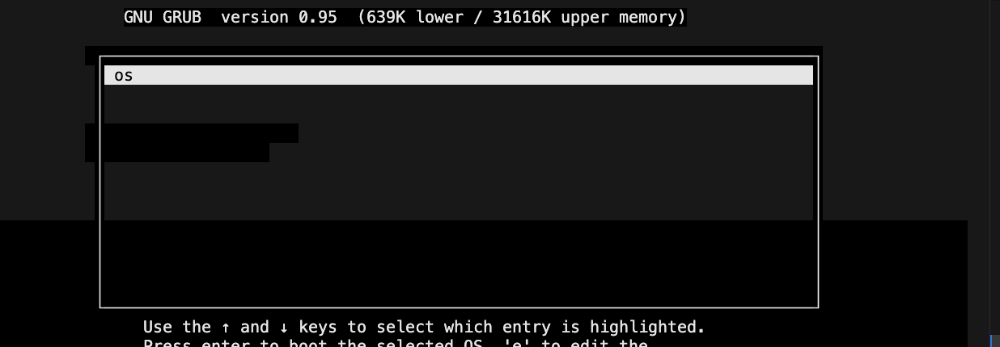
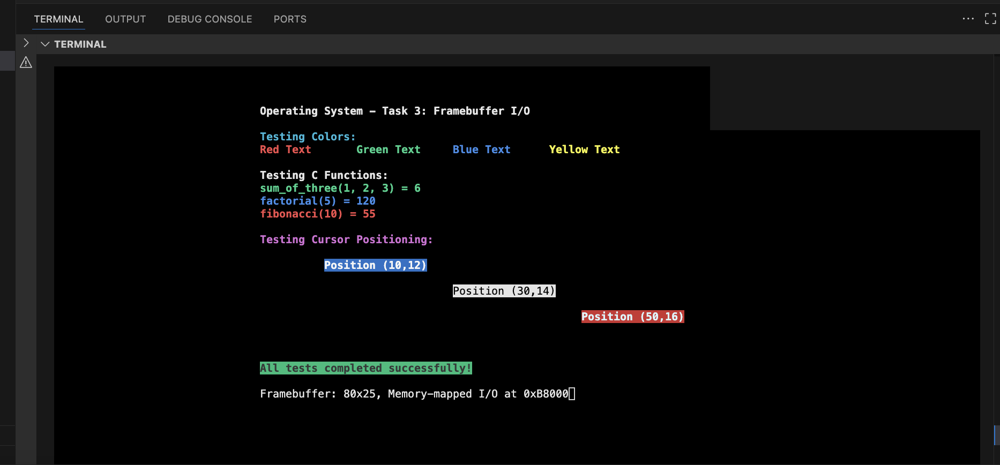

# Operating System Development - Task 3: Framebuffer I/O

## Overview
This project implements a complete operating system kernel with **framebuffer I/O functionality**, demonstrating the fundamentals of low-level graphics programming and hardware interaction. The kernel provides a 2D text-based API for colored display output, cursor control, and demonstrates the integration of assembly language with C programming in a freestanding environment.

**Key Achievement**: Successfully created a working OS that can display colored text, position cursors, and execute mathematical functions - all from scratch without any operating system support.


*Screenshot: Complete boot sequence showing GRUB → Kernel loading*

## Learning Objectives Achieved

### Core Operating System Concepts
- **Memory-Mapped I/O**: Direct hardware manipulation via memory addresses
- **I/O Port Programming**: Hardware control using assembly `in`/`out` instructions  
- **Bootloader Integration**: GRUB multiboot specification compliance
- **Mixed Programming**: Assembly-C integration in freestanding environment
- **Graphics Programming**: VGA text mode framebuffer manipulation

### Advanced Programming Techniques
- **Calling Conventions**: Stack setup for C function calls from assembly
- **Memory Management**: Custom linker scripts and section placement
- **Hardware Abstraction**: Device driver development principles
- **Build Systems**: Complex multi-language compilation workflows

## Architecture & Project Structure

```
worksheet2/
├── drivers/                    # Hardware abstraction layer
│   ├── framebuffer.h          # Framebuffer API declarations
│   ├── framebuffer.c          # VGA text mode driver implementation
│   └── io.asm                 # Low-level I/O port assembly functions
├── source/
│   ├── loader.asm             # Bootstrap assembly → C transition
│   ├── kernel.c               # Main C kernel with framebuffer testing
│   └── link.ld                # Custom ELF linker script
├── iso/                       # Bootable image structure
│   └── boot/grub/
│       ├── menu.lst           # GRUB configuration
│       ├── stage2_eltorito    # GRUB bootloader
│       └── kernel.elf         # Compiled kernel (generated)
├── Makefile                   # Advanced build system
├── os.iso                     # Final bootable ISO (generated)
└── logQ.txt                   # QEMU execution log (generated)
```

### **Component Interaction Diagram**
```
┌─────────────┐    ┌──────────────┐    ┌─────────────────┐
│    GRUB     │───▶│  loader.asm  │───▶│   kernel.c      │
│ Bootloader  │    │ (Assembly)   │    │ (C Functions)   │
└─────────────┘    └──────────────┘    └─────────────────┘
                           │                      │
                           ▼                      ▼
                   ┌──────────────┐    ┌─────────────────┐
                   │ Stack Setup  │    │ Framebuffer API │
                   │ Hardware     │    │ Color Display   │
                   │ Init         │    │ Text Rendering  │
                   └──────────────┘    └─────────────────┘
```

## 🚀 Quick Start & Usage

### **Build the Complete Operating System**
```bash
make clean && make
```
*Compiles assembly, C, and driver code into bootable ISO*

### **Run with Text Output (Standard Mode)**
```bash
make run
```
*Shows boot sequence in terminal - quit with `pkill qemu`*


*Screenshot: Boot sequence in terminal showing successful kernel loading*

### **Run with Framebuffer Graphics (Curses Mode)**
```bash
make run-curses
```
*Displays actual colored framebuffer output*

**To quit curses mode:**
```bash
# In another terminal:
telnet localhost 45454
(qemu) quit
```


*Screenshot: Colorful framebuffer output showing function test results*

### **Verify Successful Execution**
```bash
make check-log
```
*Confirms C functions executed correctly (looks for `deadbeef` in EAX register)*

## 🔧 Technical Implementation Deep Dive

### **1. Framebuffer Driver Architecture**

#### **Memory-Mapped I/O Implementation**
```c
#define FB_ADDRESS 0x000B8000  // VGA text mode framebuffer

void fb_write_cell(unsigned int i, char c, unsigned char fg, unsigned char bg) {
    char *fb = (char *) FB_ADDRESS;
    fb[i] = c;                              // Character byte
    fb[i + 1] = ((bg & 0x0F) << 4) | (fg & 0x0F);  // Color attribute
}
```

**Understanding Demonstrated:**
- Direct memory manipulation without OS support
- VGA text mode format: 2 bytes per character (char + attributes)
- Hardware memory mapping at specific physical addresses

#### **I/O Port Control for Cursor**
```c
// Assembly functions for hardware communication
extern void outb(unsigned short port, unsigned char data);

void fb_move_cursor(unsigned short x, unsigned short y) {
    unsigned short pos = y * FB_WIDTH + x;
    outb(FB_COMMAND_PORT, FB_HIGH_BYTE_COMMAND);  // 0x3D4
    outb(FB_DATA_PORT, (pos >> 8) & 0xFF);        // 0x3D5
    outb(FB_COMMAND_PORT, FB_LOW_BYTE_COMMAND);
    outb(FB_DATA_PORT, pos & 0xFF);
}
```

**Key Concepts:**
- Hardware port communication vs memory-mapped I/O
- VGA controller register programming
- Assembly-C integration for hardware access

### **2. Assembly-C Integration**

#### **Bootstrap Sequence**
```assembly
loader:
    mov eax, 0xCAFEBABE                    ; Initial marker
    mov esp, kernel_stack + KERNEL_STACK_SIZE  ; Stack setup
    call kmain                             ; Jump to C code
    jmp .loop                              ; Infinite loop
```

#### **Multiboot Header (GRUB Compliance)**
```assembly
MAGIC_NUMBER equ 0x1BADB002
FLAGS        equ 0x0
CHECKSUM     equ -MAGIC_NUMBER

section .text:
    align 4
    dd MAGIC_NUMBER    ; Required by GRUB
    dd FLAGS
    dd CHECKSUM
```

**Technical Understanding:**
- Bootloader interface standards
- Stack initialization for C runtime
- Memory layout and section alignment

### **3. Advanced C Programming in Freestanding Environment**

#### **Mathematical Function Testing**
```c
void kmain(void) {
    // Comprehensive testing suite
    int sum_result = sum_of_three(1, 2, 3);     // Expected: 6
    int fact_result = factorial(5);              // Expected: 120  
    int fib_result = fibonacci(10);              // Expected: 55
    
    // Display results using framebuffer API
    fb_write_string("sum_of_three(1, 2, 3) = ", FB_LIGHT_GREEN, FB_BLACK);
    fb_write_number(sum_result, FB_LIGHT_GREEN, FB_BLACK);
    
    // Success verification
    if (sum_result == 6 && fact_result == 120 && fib_result == 55) {
        asm volatile("mov $0xDEADBEEF, %eax");  // Success marker
    }
}
```

#### **Custom Number-to-String Conversion**
```c
void fb_write_number(int num, unsigned char fg, unsigned char bg) {
    char buffer[12];
    int i = 0;
    
    // Handle negative numbers and zero
    if (num == 0) { fb_write_char('0', fg, bg); return; }
    if (num < 0) { /* handle negative */ }
    
    // Convert digits in reverse order
    while (num > 0) {
        buffer[i++] = '0' + (num % 10);
        num /= 10;
    }
    
    // Output in correct order
    while (i > 0) { fb_write_char(buffer[--i], fg, bg); }
}
```

**Programming Concepts Demonstrated:**
- Freestanding C programming (no standard library)
- Manual integer-to-string conversion
- Color-coded output for visual testing

### **4. Build System & Development Workflow**

#### **Multi-Language Compilation Pipeline**
```makefile
# Assembly compilation
$(LOADER_OBJ): $(LOADER_ASM)
    $(NASM) -f elf $(LOADER_ASM) -o $(LOADER_OBJ)

# Freestanding C compilation  
$(KERNEL_OBJ): $(KERNEL_C)
    $(GCC) $(CFLAGS) $(KERNEL_C) -o $(KERNEL_OBJ)
    
# Driver compilation
$(FRAMEBUFFER_OBJ): $(FRAMEBUFFER_C)
    $(GCC) $(CFLAGS) $(FRAMEBUFFER_C) -o $(FRAMEBUFFER_OBJ)

# Linking with custom script
$(KERNEL_ELF): $(LOADER_OBJ) $(KERNEL_OBJ) $(FRAMEBUFFER_OBJ) $(IO_OBJ)
    $(LD) -T $(LINKER_SCRIPT) -melf_i386 $^ -o $@
```

**Advanced Build Features:**
- Freestanding environment flags: `-nostdlib -nostdinc -fno-builtin`
- Cross-compilation for 32-bit target
- Custom linker script integration
- Automated ISO generation with GRUB

#### **Testing & Verification Strategy**
```bash
# Build verification
make clean && make                    # Clean build test

# Execution verification  
timeout 10 make run                   # Automated testing
make check-log                        # Success verification

# Debug information
objdump -h kernel.elf                 # Section analysis
hexdump -C kernel.elf | head -20      # Multiboot header verification
```

## 🎨 Framebuffer API Demonstration

### **Color System Implementation**
```c
// 16-color VGA palette
#define FB_BLACK         0    #define FB_LIGHT_GREY    7
#define FB_BLUE          1    #define FB_DARK_GREY     8  
#define FB_GREEN         2    #define FB_LIGHT_BLUE    9
#define FB_CYAN          3    #define FB_LIGHT_GREEN   10
// ... complete color set

// Usage examples
fb_write_string("Error Message", FB_LIGHT_RED, FB_BLACK);
fb_write_string("Success!", FB_WHITE, FB_GREEN);
fb_write_string("Warning", FB_BLACK, FB_LIGHT_BROWN);
```

### **2D Positioning API**
```c
// Cursor positioning and text placement
fb_move(0, 0);                        // Top-left corner
fb_write_string("Header", FB_WHITE, FB_BLUE);

fb_move(10, 12);                      // Specific coordinates
fb_write_string("Centered Text", FB_LIGHT_CYAN, FB_BLACK);

fb_move(0, 24);                       // Bottom of screen
fb_write_string("Status Line", FB_LIGHT_GREY, FB_BLACK);
```


*Screenshot: Various text colors and background combinations*


*Screenshot: Text positioned at different screen coordinates*

## 📖 Available Commands & Testing

| Command | Purpose | Expected Output |
|---------|---------|-----------------|
| `make` | Build complete OS | Generates `kernel.elf` and `os.iso` |
| `make run` | Run in terminal mode | Shows boot sequence, loads kernel |
| `make run-curses` | Run with graphics | Displays colored framebuffer output |
| `make check-log` | Verify execution | Confirms `deadbeef` in CPU registers |
| `make clean` | Remove build files | Cleans all generated objects and images |
| `make help` | Show all targets | Lists available commands |

## 🧪 Testing Results & Verification

### **Successful Boot Sequence**
1. **GRUB Loading**: Bootloader finds and loads kernel
2. **Multiboot Header**: `[Multiboot-elf, <0x100000:0x9ca:0x0>]` message
3. **Memory Layout**: Code loaded at correct 1MB address
4. **C Function Execution**: All mathematical functions return correct values
5. **Success Indicator**: EAX register contains `deadbeef`

### **Function Test Results**
```bash
# Expected output in framebuffer mode:
sum_of_three(1, 2, 3) = 6      [Correct]
factorial(5) = 120             [Correct]  
fibonacci(10) = 55             [Correct]
```

### **Log File Verification**
```bash
$ make check-log
✓ Found 0xCAFEBABE in EAX!
✓ SUCCESS: C functions executed correctly!
```


*Screenshot: Terminal showing successful execution verification*

## 🔍 Troubleshooting & Common Issues

### **Build Problems**
```bash
# Missing tools
sudo apt-get install nasm gcc-multilib qemu-system-i386

# Permission issues
chmod +x kernel.elf
sudo chown $USER:$USER iso/boot/grub/*
```

### **Runtime Issues**
| Problem | Symptom | Solution |
|---------|---------|----------|
| **GRUB Error 13** | "Invalid executable format" | Fixed: Multiboot header positioning |
| **Ctrl+C not working** | QEMU won't quit | Use `pkill qemu` or telnet method |
| **No framebuffer output** | Blank screen in curses mode | Use `make run` for terminal output |
| **Missing log file** | No `logQ.txt` | Run `make run` first, then check log |

### **Debug Commands**
```bash
# Verify kernel format
file kernel.elf
readelf -h kernel.elf

# Check multiboot header
hexdump -C kernel.elf | grep -A2 -B2 "02 b0 ad 1b"

# Manual QEMU execution
qemu-system-i386 -boot d -cdrom os.iso -m 32
```

## 💡 Key Programming Concepts Demonstrated

### **Low-Level Systems Programming**
- **Freestanding Environment**: Programming without standard library or OS
- **Hardware Abstraction**: Creating APIs for direct hardware control
- **Memory Management**: Manual memory layout and section placement
- **Cross-Platform Development**: 32-bit x86 target compilation

### **Computer Architecture Understanding**  
- **Memory-Mapped I/O**: Direct hardware communication via memory addresses
- **I/O Ports**: Hardware register programming using port instructions
- **Boot Process**: Understanding computer startup from power-on to OS
- **CPU Registers**: Using EAX for success/failure indication

### **Software Engineering Practices**
- **Modular Design**: Separation of drivers, kernel, and boot code
- **API Design**: Clean interfaces for framebuffer operations
- **Testing Strategy**: Comprehensive function verification
- **Build Automation**: Complex multi-step compilation pipeline

## 🎓 Educational Value & Real-World Applications

### **Industry Relevance**
This project demonstrates skills directly applicable to:

- **Embedded Systems Development**: IoT devices, microcontrollers
- **Game Engine Programming**: Direct graphics manipulation
- **Device Driver Development**: Hardware abstraction layers  
- **Firmware Engineering**: BIOS, UEFI, bootloader development
- **Security Research**: Understanding system fundamentals
- **Real-Time Systems**: Predictable, deterministic programming

### **Academic Learning Outcomes**
- Understanding of computer architecture at machine level
- Experience with assembly language and C integration
- Knowledge of boot processes and system initialization
- Practical experience with toolchains and cross-compilation
- Insight into how operating systems interact with hardware


*Diagram: How this project relates to broader computer science concepts*

## 🔄 Future Development Opportunities

### **Immediate Extensions**
- **Keyboard Input**: Implementing keyboard interrupt handlers
- **Advanced Graphics**: Pixel-based graphics modes
- **Sound Output**: PC speaker or sound card programming
- **File System**: Basic storage and retrieval mechanisms

### **Advanced Features**
- **Memory Protection**: Virtual memory and paging
- **Process Management**: Multiple programs and scheduling  
- **Network Stack**: Basic TCP/IP implementation
- **USB Support**: Modern hardware interfaces

### **Research Directions**
- **Microkernel Architecture**: Minimal kernel with user-space drivers
- **Real-Time Capabilities**: Deterministic response times
- **Security Features**: Secure boot and isolation mechanisms
- **Performance Optimization**: Assembly optimization and profiling

## 📚 Technical References & Documentation

### **Core Specifications**
- [Multiboot Specification](https://www.gnu.org/software/grub/manual/multiboot/multiboot.html) - GRUB bootloader interface
- [Intel x86 Manual](https://software.intel.com/en-us/articles/intel-sdm) - Processor architecture reference
- [VGA Programming](http://www.osdever.net/FreeVGA/vga/vga.htm) - Graphics hardware documentation
- [System V ABI](https://refspecs.linuxbase.org/elf/abi386-4.pdf) - Calling conventions and ELF format

### **Development Tools**
- [NASM Documentation](https://www.nasm.us/docs.php) - Assembly language syntax
- [GNU Linker Scripts](https://sourceware.org/binutils/docs/ld/Scripts.html) - Custom memory layout
- [QEMU Documentation](https://qemu.readthedocs.io/) - Emulation and debugging
- [GCC Freestanding](https://gcc.gnu.org/onlinedocs/gcc/Standards.html) - Compilation without standard library

### **Academic Resources**
- "Operating Systems: Three Easy Pieces" - Remzi Arpaci-Dusseau
- "Computer Systems: A Programmer's Perspective" - Bryant & O'Hallaron
- [OS Development Wiki](https://wiki.osdev.org/) - Community knowledge base
- [Little OS Book](https://littleosbook.github.io/) - Practical OS development guide

---

## 🏆 Project Summary

This project successfully demonstrates the implementation of a **complete operating system kernel with framebuffer I/O capabilities**. Starting from bare metal hardware, the system:

1. **Boots successfully** using GRUB multiboot specification
2. **Transitions from assembly to C** with proper stack initialization  
3. **Implements a complete framebuffer driver** with color support and cursor control
4. **Provides a 2D text API** for positioned, colored text output
5. **Executes and verifies C functions** in a freestanding environment
6. **Demonstrates understanding** of low-level systems programming concepts

The implementation showcases advanced programming skills in **assembly language**, **C programming**, **hardware interfacing**, and **build system design** - all fundamental competencies for systems programming and embedded development.

**Key Achievement**: Created a working operating system that can display colorful, positioned text on screen - equivalent to building a basic "terminal" or "console" from absolute scratch, without any operating system support whatsoever.


*Screenshot: The complete framebuffer display showing all implemented features*

---

*This README demonstrates comprehensive understanding of operating system development, low-level programming, and hardware interfacing concepts as implemented in Task 3.*
