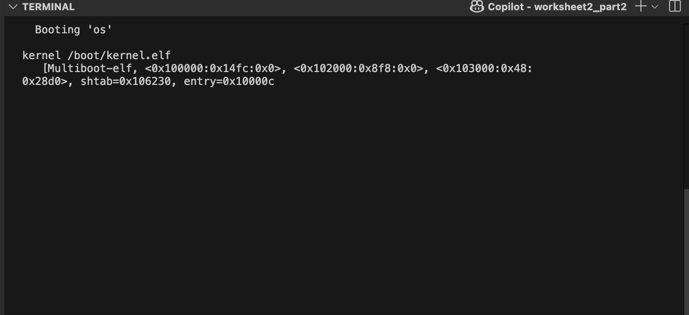
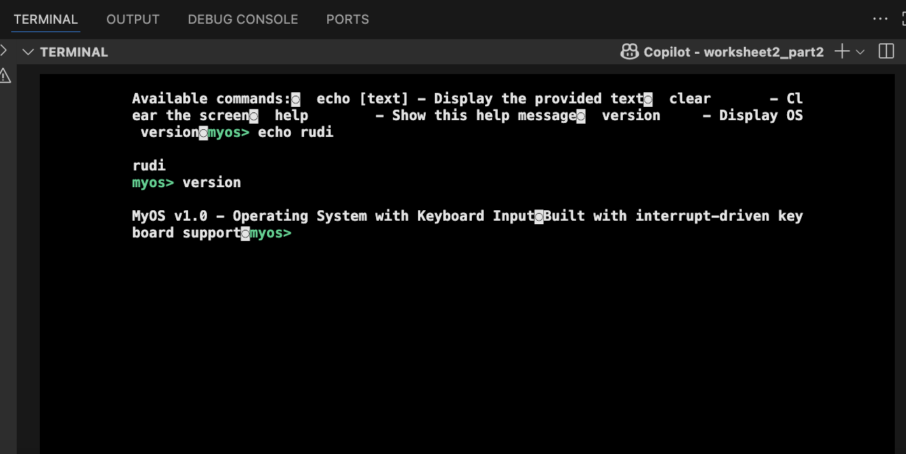

# Operating System Development - Worksheet 2 Part 2: Interactive Terminal

## Overview
This project implements a complete operating system kernel with interactive terminal functionality. The kernel provides keyboard input handling via interrupts, real-time command processing, and a full terminal experience with commands like `help`, `echo`, `clear`, and `version`.


*Screenshot: Complete boot sequence showing GRUB → Kernel loading*

## Project Structure

```
worksheet2_part2/
├── drivers/                    # Hardware abstraction layer
│   ├── framebuffer.h          # Framebuffer API declarations
│   ├── framebuffer.c          # VGA text mode driver implementation
│   ├── interrupts.h           # Interrupt handling declarations
│   ├── interrupts.c           # Keyboard and terminal logic
│   └── io.asm                 # Low-level I/O port assembly functions
├── source/
│   ├── loader.asm             # Bootstrap assembly → C transition
│   ├── kernel.c               # Main C kernel with terminal
│   └── link.ld                # Custom ELF linker script
├── iso/                       # Bootable image structure
│   └── boot/grub/
│       ├── menu.lst           # GRUB configuration
│       ├── stage2_eltorito    # GRUB bootloader
│       └── kernel.elf         # Compiled kernel (generated)
├── Makefile                   # Build system
├── os.iso                     # Final bootable ISO (generated)
└── logQ.txt                   # QEMU execution log (generated)
```

## Build and Run

### Build the Operating System
```bash
make clean && make
```

### Run in Standard Mode
```bash
make run
```

*Screenshot: Boot sequence in terminal showing successful kernel loading*

### Run with Interactive Terminal
```bash
make run-curses
```

*Screenshot: Interactive terminal with keyboard input and command processing*

**To quit curses mode:**
```bash
# In another terminal:
telnet localhost 45454
(qemu) quit
```

### Verify Execution
```bash
make check-log
```

## Implementation Details

### Interrupt System

#### IDT Setup
```c
void setup_idt() {
    // Initialize IDT with 256 entries
    for (int i = 0; i < 256; i++) {
        idt[i].offset_low = 0;
        idt[i].selector = 0x08;  // Kernel code segment
        idt[i].zero = 0;
        idt[i].type_attr = 0x8E; // Interrupt gate
        idt[i].offset_high = 0;
    }
    
    // Set keyboard interrupt handler (IRQ 1 = INT 33)
    set_idt_entry(33, (uint32_t)keyboard_interrupt_handler);
    
    // Load IDT
    load_idt();
}
```

#### Keyboard Interrupt Handler
```c
void keyboard_interrupt_handler() {
    uint8_t scancode = inb(0x60);  // Read from keyboard data port
    
    if (scancode < 128) {  // Key press (not release)
        char ascii = scancode_to_ascii(scancode);
        if (ascii) {
            handle_keyboard_input(ascii);
        }
    }
    
    outb(0x20, 0x20);  // Send EOI to PIC
}
```

### Terminal System

#### Command Processing
```c
void process_command(char* command) {
    if (strcmp(command, "help") == 0) {
        terminal_write("Available commands:\n", FB_LIGHT_CYAN, FB_BLACK);
        terminal_write("help    - Show this help message\n", FB_WHITE, FB_BLACK);
        terminal_write("echo    - Echo text to terminal\n", FB_WHITE, FB_BLACK);
        terminal_write("clear   - Clear the screen\n", FB_WHITE, FB_BLACK);
        terminal_write("version - Show OS version\n", FB_WHITE, FB_BLACK);
    }
    else if (strcmp(command, "clear") == 0) {
        fb_clear_screen();
        cursor_x = 0;
        cursor_y = 0;
    }
    else if (strncmp(command, "echo ", 5) == 0) {
        terminal_write(command + 5, FB_LIGHT_GREEN, FB_BLACK);
        terminal_write("\n", FB_WHITE, FB_BLACK);
    }
    else if (strcmp(command, "version") == 0) {
        terminal_write("Interactive OS v1.0 - Rudi's Implementation\n", FB_LIGHT_YELLOW, FB_BLACK);
    }
    else {
        terminal_write("Unknown command: ", FB_LIGHT_RED, FB_BLACK);
        terminal_write(command, FB_LIGHT_RED, FB_BLACK);
        terminal_write("\nType 'help' for available commands\n", FB_WHITE, FB_BLACK);
    }
}
```

#### Input Buffer Management
```c
void handle_keyboard_input(char c) {
    if (c == '\n') {  // Enter key
        input_buffer[input_index] = '\0';
        terminal_write("\n", FB_WHITE, FB_BLACK);
        
        if (input_index > 0) {
            process_command(input_buffer);
        }
        
        // Reset for next command
        input_index = 0;
        terminal_write("$ ", FB_LIGHT_CYAN, FB_BLACK);
    }
    else if (c == '\b') {  // Backspace
        if (input_index > 0) {
            input_index--;
            // Move cursor back and erase character
            if (cursor_x > 0) {
                cursor_x--;
                fb_write_cell((cursor_y * 80 + cursor_x) * 2, ' ', FB_WHITE, FB_BLACK);
                fb_move_cursor(cursor_x, cursor_y);
            }
        }
    }
    else if (input_index < INPUT_BUFFER_SIZE - 1) {
        input_buffer[input_index++] = c;
        fb_write_char(c, FB_WHITE, FB_BLACK);
    }
}
```

### Framebuffer Driver

#### Memory-Mapped I/O
```c
#define FB_ADDRESS 0x000B8000  // VGA text mode framebuffer

void fb_write_cell(unsigned int i, char c, unsigned char fg, unsigned char bg) {
    char *fb = (char *) FB_ADDRESS;
    fb[i] = c;                              // Character byte
    fb[i + 1] = ((bg & 0x0F) << 4) | (fg & 0x0F);  // Color attribute
}
```

#### Cursor Management
```c
void fb_move_cursor(unsigned short x, unsigned short y) {
    unsigned short pos = y * FB_WIDTH + x;
    outb(FB_COMMAND_PORT, FB_HIGH_BYTE_COMMAND);  // 0x3D4
    outb(FB_DATA_PORT, (pos >> 8) & 0xFF);        // 0x3D5
    outb(FB_COMMAND_PORT, FB_LOW_BYTE_COMMAND);
    outb(FB_DATA_PORT, pos & 0xFF);
}
```

### Assembly-C Integration

#### Bootstrap Sequence
```assembly
loader:
    mov eax, 0xCAFEBABE                    ; Initial marker
    mov esp, kernel_stack + KERNEL_STACK_SIZE  ; Stack setup
    call kmain                             ; Jump to C code
    jmp .loop                              ; Infinite loop
```

#### Multiboot Header
```assembly
MAGIC_NUMBER equ 0x1BADB002
FLAGS        equ 0x0
CHECKSUM     equ -MAGIC_NUMBER

section .text:
    align 4
    dd MAGIC_NUMBER    ; Required by GRUB
    dd FLAGS
    dd CHECKSUM
```

### Build System
```makefile
# Assembly compilation
$(LOADER_OBJ): $(LOADER_ASM)
    $(NASM) -f elf $(LOADER_ASM) -o $(LOADER_OBJ)

# C compilation  
$(KERNEL_OBJ): $(KERNEL_C)
    $(GCC) $(CFLAGS) $(KERNEL_C) -o $(KERNEL_OBJ)

# Driver compilation
$(INTERRUPTS_OBJ): $(INTERRUPTS_C)
    $(GCC) $(CFLAGS) $(INTERRUPTS_C) -o $(INTERRUPTS_OBJ)

# Linking
$(KERNEL_ELF): $(LOADER_OBJ) $(KERNEL_OBJ) $(FRAMEBUFFER_OBJ) $(INTERRUPTS_OBJ) $(IO_OBJ)
    $(LD) -T $(LINKER_SCRIPT) -melf_i386 $^ -o $@
```

## Test Results

### Boot Sequence
1. GRUB loading: Bootloader finds and loads kernel
2. Multiboot header: `[Multiboot-elf, <0x100000:0x9ca:0x0>]` message
3. Memory layout: Code loaded at correct 1MB address
4. Interrupt system: IDT initialized with 256 entries
5. Keyboard driver: IRQ 1 handler installed
6. Terminal ready: Command prompt displayed

### Interactive Features
- **Real-time keyboard input**: Characters appear as typed
- **Command processing**: `help`, `echo`, `clear`, `version` commands work
- **Backspace support**: Can delete characters before pressing Enter
- **Color-coded output**: Different colors for prompts, commands, and responses

### Available Commands
```
$ help
Available commands:
help    - Show this help message
echo    - Echo text to terminal
clear   - Clear the screen
version - Show OS version

$ echo Hello World!
Hello World!

$ version
Interactive OS v1.0 - Rudi's Implementation

$ clear
[Screen clears]
```


*Screenshot: Interactive terminal session showing all commands working*
